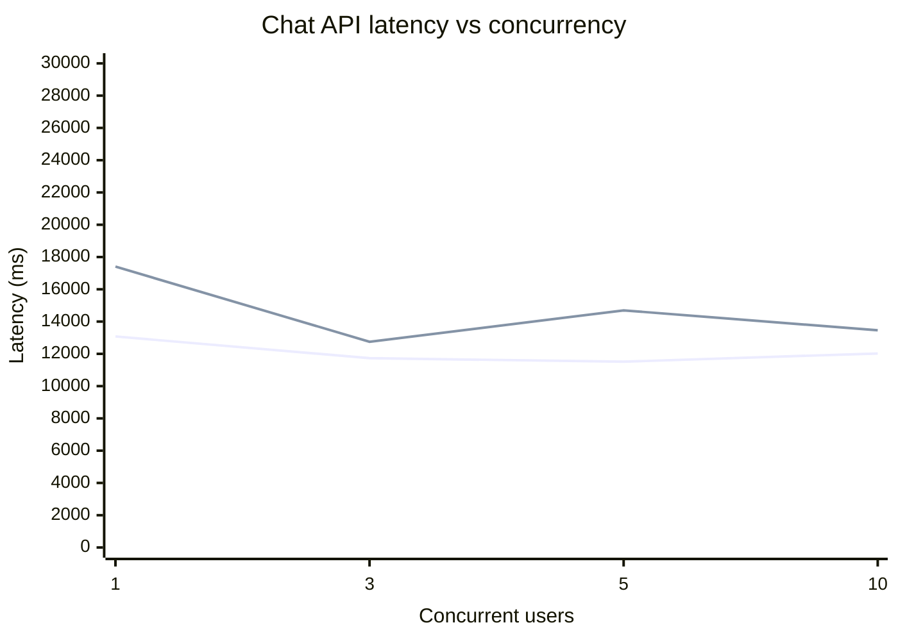
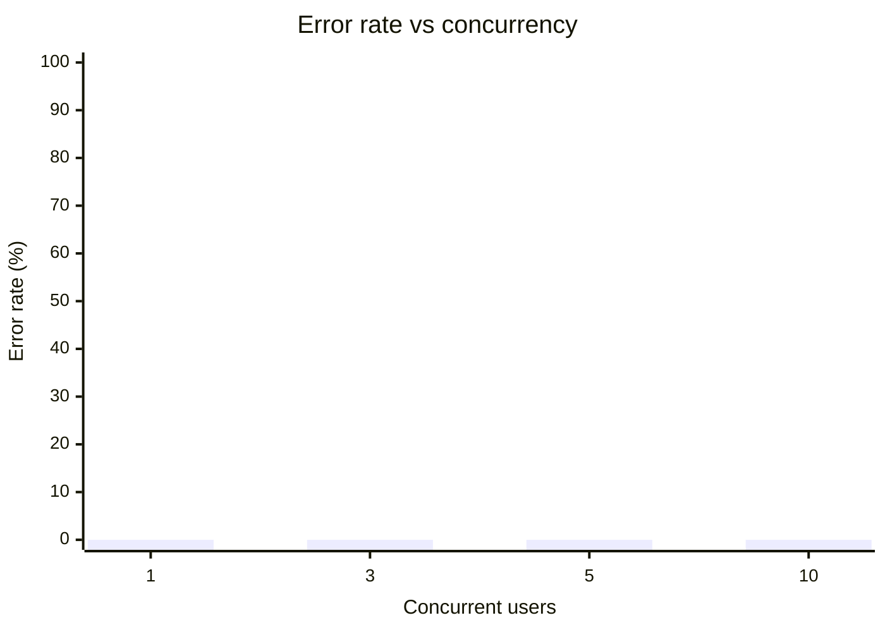
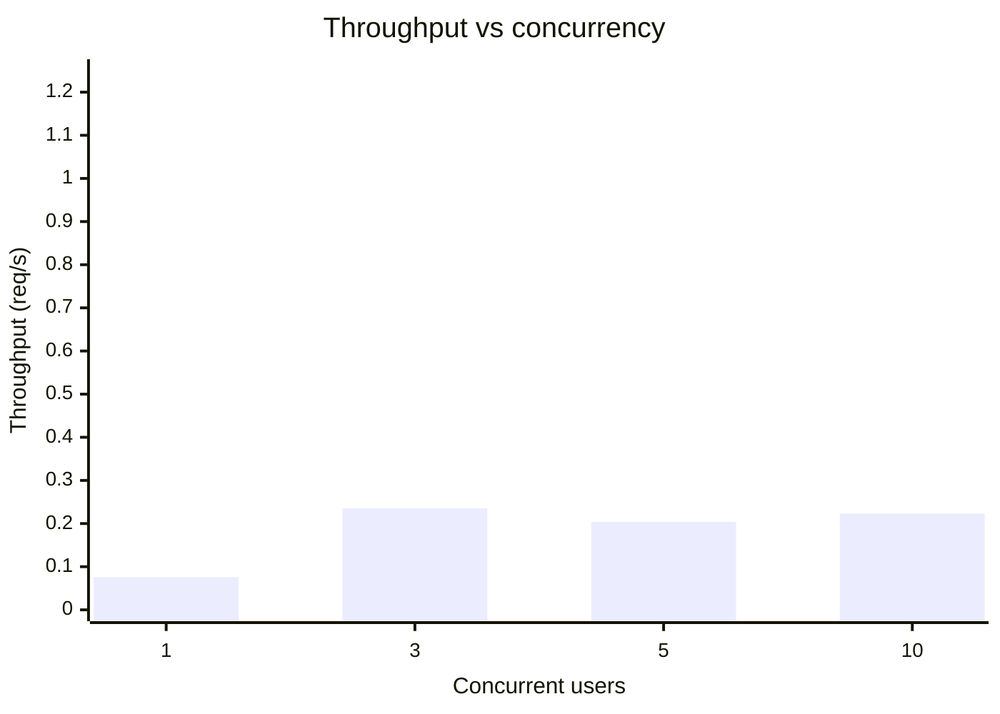

# Chat API Performance Report

- Target: http://localhost:3000/api/chat
- Started: 2026-03-29T12:02:49.376Z
- Requests per level: 3
- Timeout per request (ms): 25000
- P95 SLO (ms): 12000
- Max error rate (%): 5
- Apdex T (ms): 4000

## Latency Graph



## Error Rate Graph



## Throughput Graph



## Apdex Graph

```mermaid
xychart-beta
    title "Apdex vs concurrency"
    x-axis "Concurrent users" [1, 3, 5, 10]
    y-axis "Apdex" 0 --> 1
    line "Apdex" [0.333, 0.5, 0.5, 0.5]
```

## SLO Compliance Graph

```mermaid
xychart-beta
    title "SLO compliance by concurrency"
    x-axis "Concurrent users" [1, 3, 5, 10]
    y-axis "Pass (1) / Fail (0)" 0 --> 1
    bar "P95 SLO" [0, 0, 0, 0]
    bar "Error Budget" [1, 1, 1, 1]
```



## Results

| Concurrency | Requests | Success % | Error % | Avg (ms) | P50 (ms) | P95 (ms) | Max (ms) | Throughput (req/s) | Apdex | P95 SLO | Error Budget |
|---:|---:|---:|---:|---:|---:|---:|---:|---:|---:|---:|---:|
| 1 | 3 | 100 | 0 | 13077 | 11578 | 17407 | 17407 | 0.076 | 0.333 | FAIL | PASS |
| 3 | 3 | 100 | 0 | 11731.33 | 12006 | 12746 | 12746 | 0.235 | 0.5 | FAIL | PASS |
| 5 | 3 | 100 | 0 | 11513.67 | 10036 | 14694 | 14694 | 0.204 | 0.5 | FAIL | PASS |
| 10 | 3 | 100 | 0 | 12023.67 | 13067 | 13461 | 13461 | 0.223 | 0.5 | FAIL | PASS |

## KPI Summary

| KPI | Value |
|---|---:|
| Weighted average latency (ms) | 12086.42 |
| Weighted average error rate (%) | 0 |
| Average throughput (req/s) | 0.184 |
| Average Apdex | 0.458 |
| Overall SLO compliance (%) | 50 |


## Performance Metrics Analysis

- Best latency (lowest P95): concurrency 3 with 12746 ms
- Best throughput: concurrency 3 with 0.235 req/s
- Most reliable (lowest error): concurrency 1 with 0% error
- Recommended operating point: none met both P95 SLO and error budget in this run
- Risk flags:
  - concurrency 1: P95>12000ms
  - concurrency 3: P95>12000ms
  - concurrency 5: P95>12000ms
  - concurrency 10: P95>12000ms
