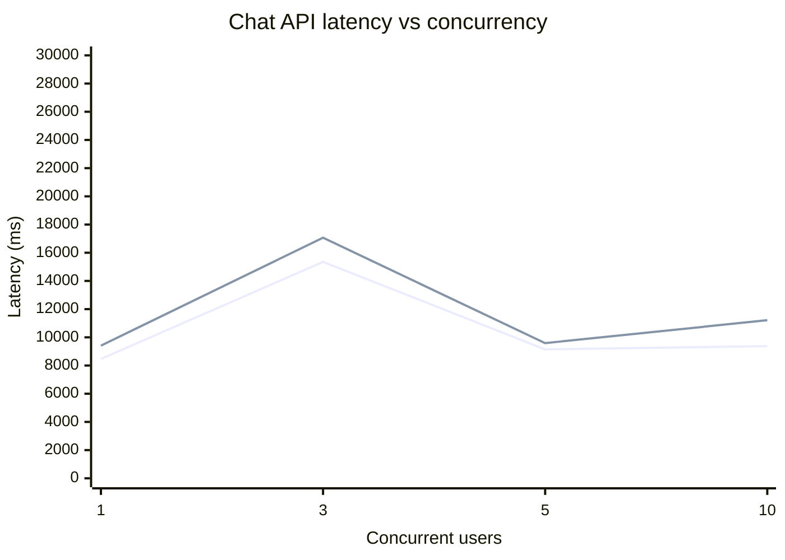
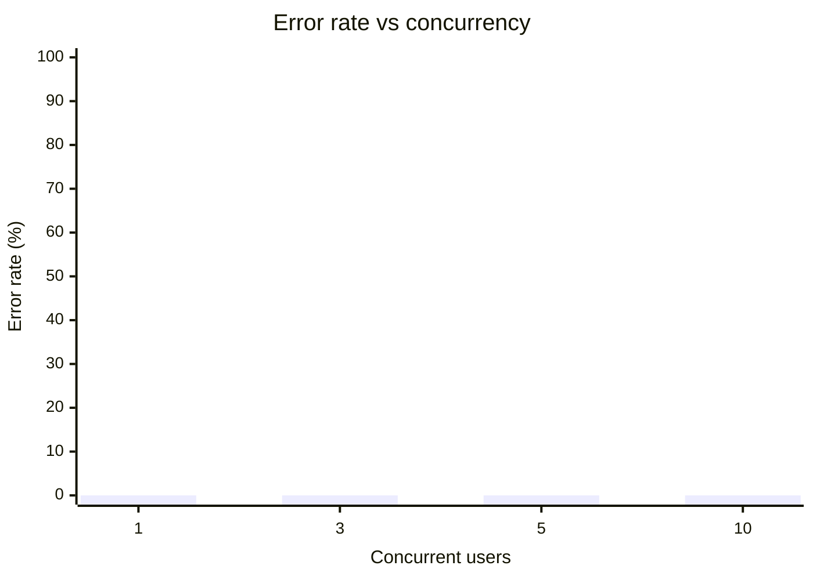
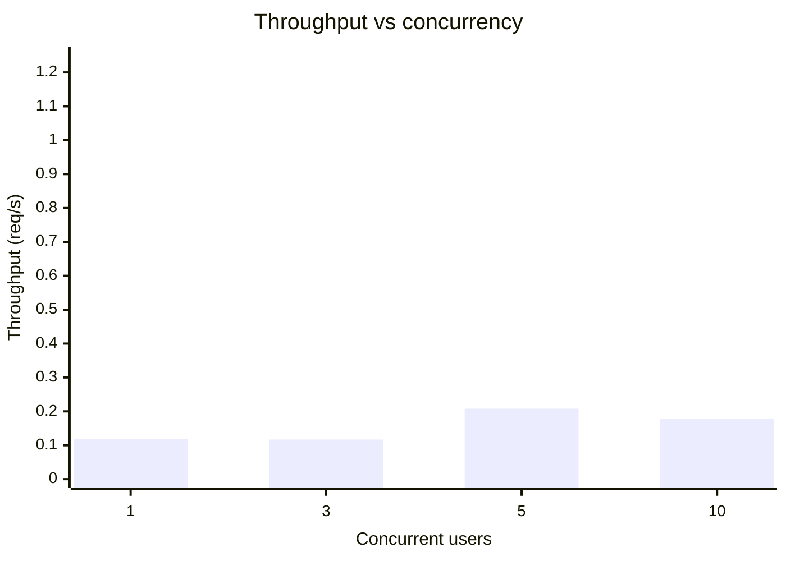

# Chat API Performance Report

- Target: http://localhost:3000/api/chat
- Started: 2026-03-29T12:11:17.240Z
- Requests per level: 2
- Timeout per request (ms): 25000
- P95 SLO (ms): 12000
- Max error rate (%): 5
- Apdex T (ms): 4000

## Latency Graph



## Error Rate Graph



## Throughput Graph



## Apdex Graph

```mermaid
xychart-beta
    title "Apdex vs concurrency"
    x-axis "Concurrent users" [1, 3, 5, 10]
    y-axis "Apdex" 0 --> 1
    line "Apdex" [0.5, 0.25, 0.5, 0.5]
```

## SLO Compliance Graph


## Results

| Concurrency | Requests | Success % | Error % | Avg (ms) | P50 (ms) | P95 (ms) | Max (ms) | Throughput (req/s) | Apdex | P95 SLO | Error Budget |
| ----------: | -------: | --------: | ------: | -------: | -------: | -------: | -------: | -----------------: | ----: | ------: | -----------: |
|           1 |        2 |       100 |       0 |     8466 |     7521 |     9411 |     9411 |              0.118 |   0.5 |    PASS |         PASS |
|           3 |        2 |       100 |       0 |    15350 |    13635 |    17065 |    17065 |              0.117 |  0.25 |    FAIL |         PASS |
|           5 |        2 |       100 |       0 |   9142.5 |     8695 |     9590 |     9590 |              0.208 |   0.5 |    PASS |         PASS |
|          10 |        2 |       100 |       0 |   9373.5 |     7533 |    11214 |    11214 |              0.178 |   0.5 |    PASS |         PASS |

## KPI Summary

| KPI                             | Value |
| ------------------------------- | ----: |
| Weighted average latency (ms)   | 10583 |
| Weighted average error rate (%) |     0 |
| Average throughput (req/s)      | 0.155 |
| Average Apdex                   | 0.438 |
| Overall SLO compliance (%)      |  87.5 |

## Performance Metrics Analysis

- Best latency (lowest P95): concurrency 1 with 9411 ms
- Best throughput: concurrency 5 with 0.208 req/s
- Most reliable (lowest error): concurrency 1 with 0% error
- Recommended operating point: concurrency 5 (meets P95 and error budget with 0.208 req/s)
- Risk flags:
  - concurrency 3: P95>12000ms
