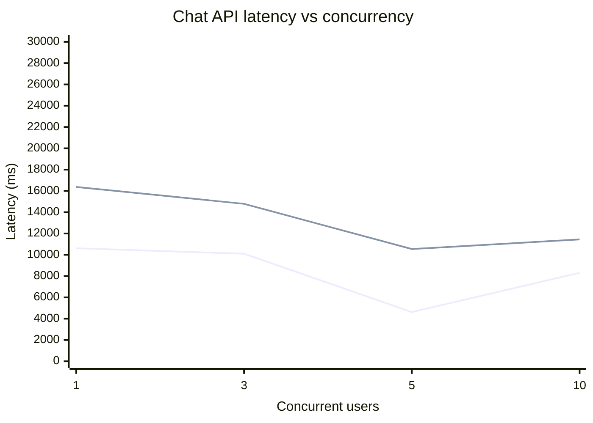

# Chat API Performance Report

- Target: http://localhost:3000/api/chat
- Started: 2026-03-29T11:39:49.245Z
- Requests per level: 20
- Timeout per request (ms): 25000

## Latency Graph

## Results

| Concurrency | Requests | Success | Error % | Avg (ms) | P50 (ms) | P95 (ms) | Max (ms) |
|---:|---:|---:|---:|---:|---:|---:|---:|
| 1 | 20 | 19 | 5 | 10615.3 | 9835 | 16371 | 17914 |
| 3 | 20 | 20 | 0 | 10102.65 | 8831 | 14787 | 21159 |
| 5 | 20 | 8 | 60 | 4621.15 | 1002 | 10540 | 13594 |
| 10 | 20 | 18 | 10 | 8310.05 | 8649 | 11443 | 12959 |
